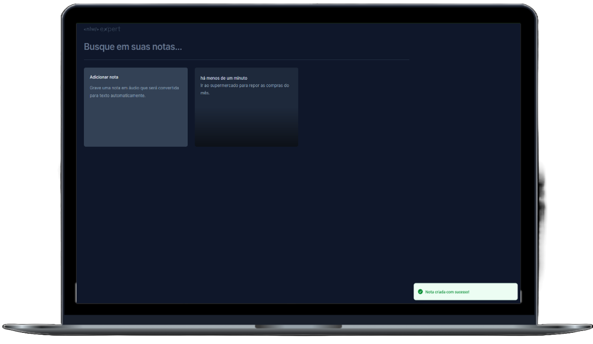

<h1 align="center">
  Notes (Anotações)
</h1>

  

## ✨ Tecnologias

Esse projeto foi desenvolvido com as seguintes tecnologias:

- [React](https://react.dev)
- [Tailwind CSS](https://tailwindcss.com)
- [TypeScript](https://www.typescriptlang.org/)

## 💻 Projeto

O Notes é um app que permite salvar uma lista de anotações para o usuário. Elas podem ser salvas através de escrita ou por áudio.

## 🔖 Acesso

[https://angular-basics-9f4ab.web.app](https://anotacoes-213b9.web.app)

## 🚀 Como executar

- Clone o repositório
- Instale as dependências com `npm install`
- Inicie o servidor com `npm run dev`

Agora você pode acessar [`localhost:5173`](http://localhost:5173) do seu navegador.

---
